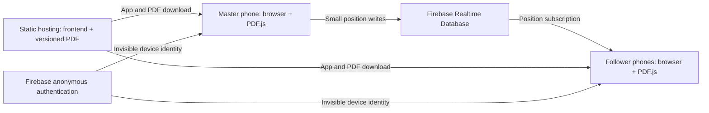

# Music Room: high-level design

Status: initial design, 2026-10-02. Implementation progress is tracked in [DETAILED_PLAN.md](DETAILED_PLAN.md).

## 1. Purpose and priorities

Music Room is a mobile-first browser app for musicians who need to read the same songbook together. One person, the **Master**, controls the shared reading position. **Followers** follow that position or temporarily explore independently.

The app runs in Android Chrome and iPhone Safari without installation or a visible login. Priorities, in order: reliable room creation/joining, reliable synchronization, smooth scrolling, mobile usability, automatic reconnection, and a clean interface.

The first milestone is deliberately small: create a room, join from another phone, load the same PDF, and follow the Master's scrolling. Additional controls follow only after this works reliably on two devices.

## 2. Scope

Version 1 includes:

- Create a room with a short numeric code; join by code or link.
- A single configured songbook, rendered independently on every device with PDF.js.
- Master-only updates to shared page, position within that page, and practical zoom synchronization.
- Master sync checkbox with temporary browsing pauses and persistent manual opt-out.
- Vertical scrolling, page navigation, page jump, zoom, and text search where the PDF supports it.
- Share link/QR code, mobile viewing, connection status, and reconnect behavior.
- Configuration and deployment instructions for static hosting and Firebase Realtime Database. Initial deployment uses Firebase Hosting with the existing CLI account; Cloudflare Pages remains an alternative.

Version 1 does not include accounts, Master handover, PDF upload per session, external chord sites, screen sharing, favorites, a custom song index, or transposition. No audio or video is transmitted.

## 3. Songbook

The supplied source is `חוברת שירים.pdf` in the repository root: 12,374,130 bytes (approximately 12.4 MB). Preserve this original file. A separately named publishing copy can be placed under `public/songbooks/` for static hosting.

Initial PDF.js inspection found 145 pages, A4-like dimensions (595.4 × 841.8 points) on sampled pages 1, 73, and 145, and no outline bookmarks. Pages 1–2 contain an extractable Hebrew index; sampled song pages 73 and 145 expose only footer text. Full-document text coverage, dimensions, and Hebrew search order still need verification. Search must not be promised for image-based lyrics. OCR is outside the initial scope.

Use a versioned URL such as `/songbooks/songbook-2026-10.pdf` and an explicit version ID. A small configuration module supplies the current URL, version, and display title. Build-time environment configuration is sufficient initially; an admin upload interface is not required.

At room creation, copy the current songbook descriptor into the room. All members load that exact descriptor, so a monthly update cannot change page meanings in an active room. New rooms use the latest configured version. Retain earlier PDF files until rooms using them have expired.

Same-origin hosting is the default. An external host must permit browser access through CORS; range-request support should be verified for efficient loading. Cache versioned files and avoid changing content at an existing versioned URL.

## 4. Architecture



Use TypeScript and Vite for a small static frontend, PDF.js for local rendering, Firebase's modular SDK for authentication and synchronization, and a QR library for sharing. No custom application server is needed.

Suggested responsibilities:

| Module | Responsibility |
| --- | --- |
| App/UI | Home, room route, controls, feedback, accessibility |
| Configuration | Firebase settings and current songbook descriptor |
| Room service | Device identity, creation, joining, subscriptions, writes |
| Position model | Validation and conversion between page-relative state and viewport coordinates |
| PDF viewer | Loading, nearby-page rendering, scrolling, page navigation, zoom, search |
| Sync controller | Throttling, interpolation, follow mode, reconnect reconciliation |
| Database rules | Master authorization, schema validation, room expiry |

Development without Firebase uses a Vite server middleware with shared in-memory rooms, Server-Sent Events for reads, and authenticated position writes using a random per-room Master token. This supports separate browsers and devices on the same LAN. The token is returned only at creation and stays in the creator tab; room reads and share links never carry it. Rooms reset on server restart. This is a debugging backend for trusted local networks, not a production service or evidence that Firebase rules pass.

Static builds without Firebase retain a labeled local-storage/BroadcastChannel browser-only fallback. Production internet hosting should use Firebase.

## 5. Room model and lifecycle

Proposed database structure:

```json
{
  "rooms": {
    "482137": {
      "masterId": "anonymous-firebase-uid",
      "createdAt": 1790899200000,
      "expiresAt": 1790985600000,
      "pdfUrl": "/songbooks/songbook-2026-10.pdf",
      "pdfVersion": "2026-10",
      "pdfTitle": "Shared songbook",
      "position": {
        "page": 37,
        "offset": 0.62,
        "zoom": 1.1,
        "horizontal": 0.7,
        "sequence": 142,
        "updatedAt": 1790899260000
      }
    }
  }
}
```

Use six-digit codes for easy entry with more room for collision avoidance than four digits. Create rooms atomically with a transaction and retry collisions. Use a numeric input with a large Join button. A direct link such as `/?room=482137` joins as a Follower unless the device has a valid saved creator session.

Rooms initially last 24 hours. This is a product default, not a requirement from the original prompt. Validate creation/expiry against database time in rules; handle client clock differences. Expired rooms are unavailable. Expiry does not physically delete data: document manual cleanup for the initial release and defer scheduled cleanup unless needed.

The creator remains the Master; refreshing on that device should restore the role through the authenticated identity and saved session. A shared link never carries a Master credential. Closing the Master tab leaves the room at its last position. There is no automatic takeover. Loss of the creator's browser identity requires creating a new room.

## 6. Synchronization

### Coordinate system

Share a one-based physical PDF page number and a normalized vertical offset within that page. The anchor is the top of the scroll viewport. Do not use whole-document percentages or raw device pixels: different phone widths produce different page heights.

Followers reconstruct the anchor using their own page geometry. Equal anchors do not imply identical amounts of visible content on different screen sizes. At the end of the document, clamp to the last reachable scroll position. Handle page gaps and mixed page sizes consistently.

Zoom means a multiplier relative to each device's base page width, not a fixed pixel size. PDF-specific pointer gestures support 75%–400% zoom, anchored under the fingers, and two-axis dragging. Synchronize horizontal travel as a normalized fraction of the device's available scroll range alongside the page-relative vertical offset. Older room state without this field defaults to the left edge. Followers apply shared zoom and both axes; different screen sizes can still show different amounts of content.

### Publish and receive

- Only the Master publishes. Enforce this in the client and database rules.
- Publish at most 15 times per second while scrolling; send a trailing update when scrolling stops.
- Coalesce pending writes rather than queueing every old position on a slow connection.
- Send explicit page jumps immediately and avoid redundant unchanged updates.
- Use a monotonic sequence to reject stale positions within a room's session.
- Followers interpolate toward the latest target with requestAnimationFrame. Large page jumps, first join, automatic/manual sync return, and reconnect can snap directly.
- Apply received position only after the PDF geometry is ready; retain the latest state during loading.
- Programmatic follower scrolls never publish updates.

Target observed latency is tens to a few hundred milliseconds on a healthy connection, not a guarantee. Measure on two physical phones and record conditions.

### Follow mode

Followers start with Master sync checked. PDF/scrollbar interaction immediately pauses local following and unchecks the checkbox; three seconds after all interaction ends, return to the latest Master position and check it again. Further activity resets the delay. Manual opt-out cancels the timer and remains off until the user checks the checkbox, which resumes immediately. Retain incoming Master state throughout the pause. Use explicit interaction events rather than scroll events so incoming Master updates never start a browsing timeout. Cancel pending timers when leaving or losing the room.

## 7. PDF performance and search

Reserve page geometry before drawing so lazy rendering does not change scroll anchors. Render only visible and nearby pages. Cancel obsolete render tasks, remove distant canvases, cap pixel density/canvas area, and avoid rendering the entire book at startup. Bound concurrent rendering and text extraction work.

Load the PDF once per device/session and use HTTP caching across sessions. Realtime messages contain no PDF bytes or page images. The actual 12.4 MB book must be tested on phones for first-page time, distant-page jumps, and sustained memory use.

Search uses extracted PDF text, including Hebrew when available. Index incrementally, provide progress/cancellation, and escape results before inserting them into the DOM. Search jumps to a physical page. Text highlighting and a curated song index are optional later additions. Clearly explain when a scanned or poorly encoded PDF cannot be searched.

## 8. Interface

Use a quiet dark background, high-contrast text, and the original light PDF pages as the focus. Home shows Create Room and Join Room. An active room has a compact header for code, role, sharing, and connection status, with the viewer occupying the remaining screen.

Use compact 32 CSS px header/toolbar controls as requested to maximize PDF space, while preserving accessible labels, keyboard support, safe-area insets, and portrait/landscape layouts. Followers have Master sync as their first bottom-toolbar element with page/zoom readouts and no vertical scrollbar. The Master sees **You are the Master**, the draggable scrollbar, and the navigation/sharing controls. There is no separate Follower button row.

Page/zoom/search controls can live in a compact bottom toolbar or simple sheet. Browser fullscreen is progressive enhancement: provide a usable expanded viewer when the browser cannot offer fullscreen. Keep Hebrew PDF content intact; UI localization can follow separately.

## 9. Connection and errors

Display Connected, Reconnecting, or Offline based on database connection state and browser network events. Anonymous authentication, missing room, expiry, permission denial, and PDF-loading failures need actionable messages and retry/leave paths.

While disconnected, keep the loaded PDF readable and allow local browsing. Stop accumulating shared writes. On reconnect, a following device reads and snaps to the current shared state; a browsing follower stays where it is. The Master sends its latest local position once connected, rather than replaying old positions. Handle mobile background/foreground transitions explicitly.

Master presence is distinct from a follower's own connection status. If a Master-online indicator is added, use connection-aware presence; an unchanged position alone does not mean the Master is disconnected.

## 10. Authorization and operating limits

No visible login does not mean an open database. Sign in anonymously so Firebase rules can bind updates to the creator UID. Authenticated participants may read a specific active room; deny room enumeration and root reads. Only the creator may modify its position. Room ownership, songbook descriptor, and lifetime are immutable after creation.

Validate required fields, types, ranges, allowed keys, and valid timestamps. Reject deletion or takeover by Followers. Test rules independently of the UI against Firebase emulators.

A short room code acts as a shared invitation, not strong confidentiality. Anonymous clients and numeric codes alone cannot provide strong abuse prevention or per-user rate limiting. This is initially for small trusted groups; revisit stronger invitations and abuse controls before broad public promotion.

Static hosting and small database updates are intended to fit free tiers for a small group. Verify current service limits before deployment and monitor usage; do not promise zero cost for arbitrary traffic. Avoid automatically introducing paid services or cleanup functions.

Firebase rule and transaction behavior references: [Realtime Database reads/writes](https://firebase.google.com/docs/database/web/read-and-write), [security rules](https://firebase.google.com/docs/database/security), and [rules API](https://firebase.google.com/docs/reference/security/database/). PDF integration reference: [Mozilla PDF.js example](https://github.com/mozilla/pdf.js/blob/master/examples/learning/helloworld.html).

## 11. Future extension boundaries

Keep source identity separate from reading position so future source adapters can support an external chord view or structured songs. Keep room transport separate from PDF rendering. Future source-specific state may contain song IDs and transposition, while a WebRTC feature would use a separate media transport.

Do not build those features now. External sites may block embedding or require authentication/subscriptions; any later integration must respect those restrictions.

## 12. Release gates

1. **Core proof:** two separate phones create/join, render the supplied book, and synchronize scrolling through Firebase.
2. **Safety and recovery:** rules reject follower writes, collision handling works, loading races are resolved, and reconnect brings following devices to the current position.
3. **Usability:** follow/browse controls, navigation, sharing, and mobile layouts work on Android Chrome and iPhone Safari.
4. **Deployment:** reproducible build, published versioned PDF, verified rules, setup guide, and measured performance.

The initial app now builds and runs locally with a versioned copy of the supplied PDF. Coordinate/coalescing tests and browser-tab create/join/follow/browse/return checks pass. Firebase cloud/emulator authorization, reconnection, and physical two-phone testing remain unverified; the release gates have not passed.
