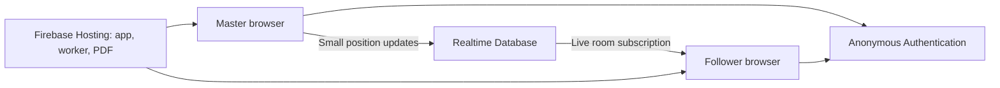

# Music Room

A mobile browser songbook: one Master controls the reading position and Followers follow or browse independently. The supplied 145-page PDF is included as a versioned static asset.

Live app: **https://talgreen-music-room.web.app**. Create a room there and share its link/code with another browser or phone; joining makes that participant a Follower. Local development also has a shared server backend for separate browsers and devices. Cloud authorization and live SDK updates have been verified; physical Android/iPhone and network-loss testing remain outstanding in [DETAILED_PLAN.md](DETAILED_PLAN.md). Architecture is in [HIGH_LEVEL_DESIGN.md](HIGH_LEVEL_DESIGN.md).

## Project structure

```text
music-room/
├── src/
│   ├── main.ts              # Screens, routing, controls, and session coordination
│   ├── rooms.ts             # Room creation, identity, subscriptions, and position writes
│   ├── model.ts             # Room/position types, validation, and scroll coordinates
│   ├── sync.ts              # Throttled Master position publisher
│   ├── viewer.ts            # PDF.js loading, rendering, zoom, and smooth following
│   ├── style.css            # Dark interface and responsive layouts
│   └── *.test.ts            # Model, publisher, and local room store tests
├── server/
│   └── local-rooms.ts       # Vite development middleware: room API and SSE streams
├── scripts/
│   ├── test-local-server.mjs # Integration check against a running development server
│   └── test-cloud-rooms.mjs  # Integration check with distinct Firebase identities
├── public/songbooks/        # Versioned PDFs copied into each build
├── index.html               # Browser entry point
├── vite.config.ts           # Development server and deployment configuration guard
├── tsconfig.json            # TypeScript compiler settings
├── package.json             # Dependencies and development/build/test commands
├── package-lock.json        # Locked dependency versions for npm ci
├── firebase.json            # Hosting, anonymous auth, database rules, and emulators
├── database.rules.json      # Server-enforced room permissions and schema validation
├── .firebaserc              # Default Firebase project
├── .env.example             # Example local-development settings
├── .env.deployment.example  # Example settings for a cloud deployment
├── HIGH_LEVEL_DESIGN.md     # Detailed architectural decisions and future boundaries
├── DETAILED_PLAN.md         # Stories, acceptance criteria, and progress checkboxes
└── README.md                # Setup, architecture, and operations guide
```

The original supplied PDF remains at the repository root. Its published copy is `public/songbooks/songbook-2026-10.pdf`. `dist/` is generated build output; `node_modules/` contains installed dependencies. Both directories, local environment files, and debug artifacts are ignored by Git.

## Architecture

The frontend is a TypeScript application built with Vite. PDF.js runs in each participant's browser using a separate worker. Firebase Hosting serves the frontend, worker, and PDF; Firebase Authentication supplies invisible anonymous identities; Realtime Database stores the shared room state.



### Room lifecycle and ownership

Creating a room reserves a six-digit code with a Firebase transaction. The room records its creator's UID, creation time, 24-hour expiry, songbook descriptor, and initial position. Joining subscribes to that specific room and loads its pinned PDF. The URL contains only the room code, for example `/?room=123456`.

`RoomService` in `src/rooms.ts` handles the backend operations. The Master UI requires both the creator's authenticated UID and a creator flag in the tab's session storage. Database rules independently enforce that only the creator may write positions. Followers can read active rooms but cannot change ownership, the PDF descriptor, or the room lifetime. Root and room-list reads are denied.

Closing the Master tab leaves the last shared position in the room; there is no automatic takeover. Losing the creator's identity/session requires creating another room. Expired Firebase records become inaccessible to participants but remain stored until a maintainer removes them.

### Position synchronization

The room is stored under `rooms/<code>` with this shape:

```json
{
  "masterId": "anonymous-firebase-uid",
  "createdAt": 1791000000000,
  "expiresAt": 1791086400000,
  "pdfUrl": "/songbooks/songbook-2026-10.pdf",
  "pdfVersion": "2026-10",
  "pdfTitle": "Songbook",
  "position": {
    "page": 37,
    "offset": 0.62,
    "zoom": 1.1,
    "sequence": 42,
    "updatedAt": 1791000001000
  }
}
```

`page` is the one-based physical PDF page. `offset` is the reading position within that page, normalized from 0 to 1, so different screen widths do not depend on identical pixel coordinates. `zoom` is relative to the viewer's base page width; its supported range is 0.75–2. `sequence` orders updates, and `updatedAt` uses server time for cloud writes.

The viewer converts Master scrolling into these coordinates. `PositionPublisher` in `src/sync.ts` throttles ordinary scroll updates to approximately 15 per second, allows only one write in flight, and replaces pending updates with the newest position. Page jumps request an immediate update. Followers interpolate toward the latest target using `requestAnimationFrame`; initial joins and large jumps snap to the target. The UI ignores stale sequences and retains the latest room state while the PDF loads.

Followers can turn following off to browse locally. Incoming updates still retain the Master's latest position. **Return to Master** restores that position and resumes following. Follower navigation never publishes shared state.

### PDF rendering and backend modes

Each browser downloads the PDF independently. The viewer creates page geometry for navigation, renders canvases near the viewport, and removes canvases that move away. Room traffic contains reading coordinates; it never contains page images or streamed screen content. Each room pins its PDF version so publishing a replacement does not change the book mid-session.

The app selects its backend from the build mode and environment settings:

| Mode | Backend | Scope |
| --- | --- | --- |
| `npm run dev`, no Firebase settings | Vite API with Server-Sent Events | Separate browsers and devices reaching the same development server |
| Complete Firebase settings | Anonymous auth and Realtime Database | Separate browsers/devices over the internet |
| Firebase emulator mode | Local auth/database emulators | Development clients reaching the emulator services |
| Ordinary build without Firebase | Local storage and BroadcastChannel | Tabs in the same browser profile and origin |

The development API lives in `server/local-rooms.ts`. It creates in-memory rooms, supplies a private write token only to the creator, accepts authenticated Master updates, and streams public room snapshots to Followers. It is mounted only by Vite's development server. Static hosting and `npm run preview` do not run this API.

The dedicated `build:deploy` command requires complete cloud Firebase settings and rejects emulator mode. Firebase Hosting runs it automatically before every upload.

## Run locally for debugging

Requires Node.js 22.12+ (Node 24 recommended) and npm.

```powershell
npm.cmd ci
npm.cmd run dev
```

Open **http://localhost:5173**. Without Firebase settings, the development server shares rooms across browsers. Create a room in the first browser, then open the same address in another browser and enter its code or follow the shared link. The joining browser becomes a Follower. No Firebase or Java setup is needed for this local flow.

The local server streams position updates using Server-Sent Events. Only the creator receives a private write token, stored in that tab's session. Shared links and room reads never include this token; the server rejects follower writes. Do not duplicate the creator tab, since browsers can copy its session storage.

Local rooms live in server memory and reset when the development server restarts; they also expire after 24 hours. Rooms created before the shared backend was added remain browser-only and cannot be joined through the new backend: create one fresh room after updating. Switching the creator's origin loses access to its tab-scoped Master token; keep the creator tab on its original address. Followers may use localhost, 127.0.0.1, or the server's LAN address as appropriate, since these all reach the same server.

The production build/`preview` has no local API server. Without Firebase it falls back to the old, explicitly labeled browser-only demo, which shares data only between tabs of the same origin/profile. Configure Firebase for deployed internet use. The local dev backend is for trusted development networks, not a production hosting alternative.

Use the browser developer tools for console errors, network requests, and breakpoints in TypeScript source. Vite updates the app as source files change. Refreshing the Master tab restores its creator session.

The dev server binds to the local network. To open it on a phone, use the **Network** URL printed by Vite, with both devices on the same Wi-Fi, and enter the room code. The shared local development backend synchronizes across those devices without Firebase. On a phone, `localhost` refers to the phone itself; use the computer's LAN address instead.

HTTP on a LAN address may lack clipboard/secure-context APIs. Copy the displayed share link manually when needed; localhost and a deployed HTTPS site support more browser capabilities. If a phone cannot reach the server, check the selected network address, Wi-Fi isolation, and your firewall's permission for Node; do not disable the firewall globally.

## Checks and production preview

```powershell
npm.cmd run check
npm.cmd run test
npm.cmd run build
npm.cmd run preview
```

With `npm.cmd run dev` already running, verify the shared backend with:

```powershell
node scripts/test-local-server.mjs
```

This creates a disposable test room and verifies independent joining, Master-only writes, live position streaming, and the reconnect snapshot.

`build` writes `dist/`. `preview` serves that build (normally port 4173). Rebuild after changes when testing production preview.

To preview the actual cloud configuration, use `npm.cmd run build:deploy` followed by `npm.cmd run preview`. The ordinary `build` command does not load `.env.deployment.local`.

## Connect real Firebase

1. Create/select a Firebase project and enable **Authentication > Sign-in method > Anonymous**. Users still see no account or login screen.
2. Create a **Realtime Database**, choosing a region near the group. Copy its database URL and the Firebase web app configuration.
3. Copy `.env.example` to `.env.local` and set the four `VITE_FIREBASE_*` values. Leave `VITE_USE_FIREBASE_EMULATORS=false`.
4. Apply `database.rules.json` in the Realtime Database Rules editor, or deploy it through the Firebase CLI to your explicitly selected project. Do not use unrestricted test rules. Review and emulator-test rules before production use.
5. Configure Firebase authorized domains for your actual hosting/development origins as appropriate. Restart Vite after editing environment variables.
6. Test from two distinct browser identities/devices. Creator identity plus saved creator session determine the Master UI; database rules independently enforce ownership.

Firebase web configuration is public client configuration, not an admin key. Never add service-account credentials to the frontend or repository. Rules are the authorization boundary.

The initial rules allow anonymous reads of a specific active room (and missing-room reads for collision-safe creation), deny enumeration, and restrict position writes to its creator. Rooms last 24 hours; old records need manual cleanup. Numeric codes are invitations for a trusted small group, not confidential-access tokens.

## Debug with local Firebase emulators

Requires the Firebase CLI and a Java runtime compatible with the installed CLI/database emulator. They are separate prerequisites from Node. The machine used for initial implementation has Firebase CLI available, but Java was not found, so emulator integration has not yet been verified.

Use a demo project ID to keep test data away from production:

```powershell
npm.cmd run emulators
```

In `.env.local`:

```dotenv
VITE_USE_FIREBASE_EMULATORS=true
VITE_FIREBASE_PROJECT_ID=demo-music-room
VITE_FIREBASE_DATABASE_URL=https://demo-music-room-default-rtdb.firebaseio.com
VITE_FIREBASE_API_KEY=demo-key
VITE_FIREBASE_AUTH_DOMAIN=demo-music-room.firebaseapp.com
```

Restart `npm.cmd run dev`. Emulator ports: Authentication 9099, Database 9000, UI 4000. Local rules come from `database.rules.json`.

For testing only on your computer, the default loopback bindings work. To use a phone, add `"host": "0.0.0.0"` under the auth and database entries in `firebase.json`, keep the network restricted to your trusted development LAN, and open the frontend through that machine's LAN address. The app defaults emulator host to the frontend hostname; `VITE_FIREBASE_EMULATOR_HOST` can override it. Emulators have no production protection and should not be exposed to the internet. Remove emulator mode before building a production deployment.

## PDF configuration and monthly updates

The root `חוברת שירים.pdf` is preserved. Its publishing copy is `public/songbooks/songbook-2026-10.pdf`.

Defaults work without PDF environment settings. To publish a replacement:

1. Add a new file under `public/songbooks/` with a new versioned name.
2. Set `VITE_PDF_URL`, `VITE_PDF_VERSION`, and `VITE_PDF_TITLE` in environment configuration.
3. Build/deploy and create a new room to verify it uses the replacement.
4. Retain previous files until rooms using them have expired, then remove obsolete publishing copies.

Every room pins its URL/version/title at creation. Active rooms keep the same book even when a newer version is published. External PDF hosts must allow CORS. Search has not been exposed in the initial UI: much of the supplied book appears to have limited extractable song text, and Hebrew search requires further verification.

## Deployment

The initial deployment uses **Firebase Hosting**, anonymous Authentication, and Realtime Database in `europe-west1`, in the dedicated project `talgreen-music-room`. No billing upgrade was made. Manage usage at https://console.firebase.google.com/project/talgreen-music-room/overview. The PDF is served by Hosting, not Cloud Storage.

### First-time setup on a machine

Install Node.js and the Firebase CLI, then sign in to an account that has access to `talgreen-music-room`:

```powershell
npm.cmd install --global firebase-tools
firebase.cmd login
firebase.cmd login:list
npm.cmd ci
Copy-Item .env.deployment.example .env.deployment.local
```

Skip copying the example if `.env.deployment.local` already exists, to preserve its configured values. Add the public web API key from **Firebase console > Project settings > Your apps > Music Room Web**. The configured production machine already has this ignored local file.

| Setting | Purpose |
| --- | --- |
| `VITE_FIREBASE_API_KEY` | Public client API key from the registered web app |
| `VITE_FIREBASE_AUTH_DOMAIN` | `talgreen-music-room.firebaseapp.com` |
| `VITE_FIREBASE_DATABASE_URL` | Full European Realtime Database URL from the example file |
| `VITE_FIREBASE_PROJECT_ID` | `talgreen-music-room` |
| `VITE_USE_FIREBASE_EMULATORS` | Must be `false` for deployment |
| `VITE_PDF_URL`, `VITE_PDF_VERSION`, `VITE_PDF_TITLE` | Optional songbook overrides |

Vite embeds `VITE_*` values into the browser bundle at build time; changing these settings requires rebuilding. Keep passwords, service-account keys, and CLI login tokens out of these files. The Firebase CLI uses its own saved sign-in session to administer and deploy the project; browser participants use anonymous authentication. `firebase.cmd logout` removes the CLI's saved access.

Deployment settings do not change `npm run dev`, which continues to use the local shared server unless `.env.local` configures Firebase. On this computer, if Firebase needs the Windows trust store, set `$env:NODE_OPTIONS='--use-system-ca'` before running its commands.

### Publish a frontend update

From the repository root:

```powershell
npm.cmd run check
npm.cmd run test
node --use-system-ca scripts/test-cloud-rooms.mjs
firebase.cmd deploy --only hosting --project talgreen-music-room
```

Hosting automatically runs `build:deploy` before uploading `dist/`. This build refuses incomplete Firebase configuration and emulator mode, so it cannot silently publish the browser-only demo. `firebase.json` configures direct-link rewrites, immutable caching for generated assets, one-day PDF caching, and HTML revalidation. On systems without the `.cmd` wrappers, use `npm` and `firebase`.

After deployment, open the live site, create a fresh room, and join from a separate browser or phone. Check the PDF, connected status, scrolling/page jumps, independent browsing, and Return to Master. Local development room codes belong to the local server; create a new room on the deployed site for internet use.

### Publish database rules or authentication changes

For intentional changes to `database.rules.json` or the auth provider configuration in `firebase.json`:

```powershell
firebase.cmd deploy --only auth,database --project talgreen-music-room
node --use-system-ca scripts/test-cloud-rooms.mjs
```

Verify the changed permissions before publishing any frontend that depends on them. The project currently enables only anonymous authentication through its tracked provider configuration.

The cloud smoke test uses two distinct anonymous identities. It checks atomic creation/collision handling, active-room reads, live position updates, late snapshots, denied Follower writes/deletion/ownership changes, denied enumeration, immutable PDF metadata, and rejected malformed positions. Expected `permission_denied` warnings demonstrate the restrictions. Each run leaves one test room that becomes unreadable after 24 hours; remove old records through the Firebase console when needed.

The Spark plan has usage limits; monitor Hosting bandwidth and database usage, especially when many new devices download the 12 MB PDF. See [Firebase pricing](https://firebase.google.com/pricing). Physical two-phone testing and extended recovery checks remain outstanding.

### Alternative: Cloudflare Pages

Cloudflare Pages can host the same frontend while Firebase continues to provide room synchronization:

| Pages setting | Value |
| --- | --- |
| Build command | `npm run build:deploy` |
| Output directory | `dist` |
| Node version | 24 |
| Environment variables | The same cloud Firebase and optional PDF settings listed above |

Serve the versioned PDFs and generated PDF.js worker from the same deployment; add the chosen host to Firebase authorized domains if needed. The Vite development API is not included in Pages. No Cloudflare resources were created for the initial deployment.

## Current controls

- Create/join by six-digit code; share link and QR.
- Master scrolls and navigates; Followers initially follow automatically.
- Switch off Following Master to scroll, change page, or zoom independently.
- Return to Master snaps to the newest shared position and resumes following.
- Page numbers refer to physical PDF pages, not printed songbook numbering.
- While following, independent vertical gestures/page controls are locked to prevent conflicting movement.

Realtime traffic contains only page, normalized offset, relative zoom, sequence, and timestamp. PDF pages render locally and nearby canvases are retained rather than rendering all pages simultaneously.
