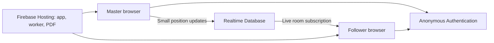

# Music Room

A mobile browser songbook: the Master and approved Followers control the shared view; other Followers follow or browse independently. Share the supplied 145-page PDF, any uploaded PDF, or automatically stitched screenshots from a reusable file library.

Live app: [Music Room](https://talgreen-music-room.web.app). Create a room and share its link/code with another browser or phone; joining makes that participant a Follower. Local development also supports separate browsers and phones. Architecture is in [HIGH_LEVEL_DESIGN.md](HIGH_LEVEL_DESIGN.md); progress and remaining comprehensive device/recovery checks are in [DETAILED_PLAN.md](DETAILED_PLAN.md).

This guide includes the shared room control feature, updated on 2026-10-10.

## Features at a glance

| Area | Current behavior |
| --- | --- |
| Rooms | Six-digit codes, 24-hour lifetime, no musician login, invitation links and QR codes. |
| Master | Controls the displayed file, page, zoom and both scroll axes. Compact header shows Master and a larger room code. |
| Followers | Manual browsing pauses sync for three seconds; manual sync opt-out persists until checked again. No Master navigation buttons, search icon or vertical scrollbar. |
| Viewer | PDF.js rendering, internal PDF links, document-only pinch/trackpad zoom, two-axis dragging, RTL alignment and Master fast-scroll/page controls. |
| Library | Persistent PDFs and automatically stitched screenshots. Masters, Followers and Settings administrators can add files; the Master or an approved controller selects the shared view. |
| Shared control | Followers enable Control room with the Settings password or owner approval. Requests show pending; approved controllers select files and drag/zoom alongside the owner. |
| Settings | Room/file lists, previews, uploads, original PDF replacement, default selection and deletion. Room deletion offers keep files, delete files or cancel. |
| Search | Master header and Settings search across all files or the current room file. Names and readable PDF text, no OCR; redundant index/song-page matches removed. |
| Sharing | Standard share icon; separate native phone sharing and Copy link actions, plus QR. Native sharing depends on browser support and a secure context. |
| Explainer | Home-page Hebrew link opens the portrait animation with muted autoplay, Play/Pause, Stop, seeking, volume, mute and a Back to home link. |

## Room controls

The Master opens **☰** for **Add file/song**, **Select file/song**, **Settings**, and the default-checked **RTL** checkbox, in that order. Search uses the separate header icon. The lower toolbar has **↑** (page 1), previous page, page input and next page. Zoom is a document gesture; there are no Master zoom buttons or percentage readout. When viewing a library file, a **PDF** button returns to the room's pinned original songbook.

Followers open **☰** for **Add file/song**, **View files/songs** and **Settings**. File previews are private and do not change the shared view. Their lower toolbar starts with **Master sync**, followed by zoom/page information. Both roles show the larger room code. Settings can open over an active room without disconnecting it; its password input receives focus.

### Shared room control

The last element in a Follower's bottom toolbar is **Control room**. Check it to enter the Settings password or choose **Ask for approval**. The password field receives focus. A request closes the dialog and displays **pending** next to the checked box. Pending requests grant no editing rights. The owner opens the header's **Requests** button and approves or denies individual requests; the list refreshes while open.

After approval or successful password entry, the participant is labeled **Controller** and gets the shared file selector, search and navigation controls, plus document drag/zoom. The owner remains **Master**. Both receive each other's changes; the latest accepted edit wins, with monotonic sequence numbers. Unchecking **Control room** cancels a pending request or releases control and returns to following. Only the owner can approve requests through the room UI. Controllers cannot approve others, change ownership/lifetime, set the global default, delete files or delete rooms.

Password unlocking briefly uses the separate Settings identity to grant this musician's room-specific permission, then signs Settings out. It does not replace anonymous musician authentication or leave Settings unlocked. Anyone who knows that password already has Settings access; use owner approval to delegate room-only permissions without revealing it. Grants last for the room lifetime unless released. Local development binds grants to a join session; refreshing/rejoining creates a new session and requires approval again. Firebase grants use the anonymous UID and remain while that identity and room survive. Browser-only static demos do not support shared control.

This feature changes Firebase rules: deploy Database rules, run `node --use-system-ca scripts/test-cloud-control.mjs` against the updated rules, and then deploy Hosting. The cloud check creates/removes only its own rooms and does not change the catalog, default or Storage. Local tests do not verify production rules.

## Project structure

```text
music-room/
|-- src/
|   |-- main.ts              # Routing, room menus and session coordination
|   |-- rooms.ts             # Backend selection, identity, rooms and uploads
|   |-- model.ts             # Room/position validation and coordinates
|   |-- sync.ts              # Throttled Master publisher
|   |-- control-dialog.ts    # Password/request and owner approval dialogs
|   |-- follower-sync.ts     # Temporary browsing and manual sync preference
|   |-- viewer.ts            # PDF/image rendering and smooth following
|   |-- gestures.ts          # Document drag/pinch/trackpad gestures
|   |-- scrollbar.ts         # Master fast-scroll control
|   |-- pdf-links.ts         # Internal PDF destination resolution
|   |-- search.ts            # Matching and result deduplication
|   |-- pdf-search.ts        # Text/link extraction and local index cache
|   |-- search-dialog.ts     # Global/current-file search interface
|   |-- stitch.ts            # Screenshot overlap matching
|   |-- screenshot-import.ts # Decoding, cropping and bounded JPEG export
|   |-- file-upload.ts       # Local/Supabase PDF upload client
|   |-- sheet-dialog.ts      # Upload/stitch/original-replacement dialog
|   |-- song-dialog.ts       # Auto-refreshing library and private previews
|   |-- song-library.ts      # Metadata, room attribution and cleanup helpers
|   |-- sheets.ts            # PDF/image manifests and validation
|   |-- settings.ts          # Administrator screen and in-room dialog
|   |-- admin.ts             # Administrator backend/Storage operations
|   |-- room-delete-dialog.ts # Keep/delete-files choice
|   |-- songbook.ts          # Original PDF descriptor and upload validation
|   |-- settings-password.mjs # Shared Settings credential conversion
|   |-- icons.ts, clipboard.ts # Standard icons and mobile copy fallback
|   |-- style.css            # Dark responsive layouts
|   `-- *.test.ts            # Focused unit and regression checks
|-- server/
|   |-- local-rooms.ts       # Development API, upload sessions and SSE
|   |-- song-library.ts      # Durable local catalog/default and cleanup
|   `-- admin-auth.ts        # Local password sessions
|-- scripts/
|   |-- test-local-server.mjs, test-settings.mjs
|   |-- test-file-library.mjs, test-room-files.mjs
|   |-- test-follower-uploads.mjs, test-pdf-compat.mjs
|   |-- test-shared-control.mjs, test-cloud-control.mjs
|   |-- test-local-suite.mjs  # Isolated integration runner
|   |-- test-cloud-rooms.mjs, test-cloud-settings.mjs
|   |-- test-cloud-files.mjs, test-cloud-sheets.mjs
|   `-- setup-settings-admin.mjs
|-- supabase/
|   |-- files.sql            # Shared PDF bucket and UID-scoped policies
|   |-- sheets.sql           # JPEG bucket and UID-scoped policies
|   `-- storage.sql          # Legacy Settings PDF bucket
|-- public/
|   |-- songbooks/           # Bundled versioned PDFs
|   `-- explainer/           # Standalone Hebrew animation and soundtrack
|-- index.html, vite.config.ts, tsconfig.json
|-- package.json, package-lock.json
|-- .github/workflows/tests.yml # PR/main local checks
|-- firebase.json, database.rules.json, .firebaserc
|-- .env.example, .env.deployment.example
|-- HIGH_LEVEL_DESIGN.md, DETAILED_PLAN.md, WEBSITE_CASTING_DESIGN.md
|-- TESTING.md               # Coverage map and acceptance checklists
|-- AGENTS.md                # Contributor rules, testing/docs and release workflow
`-- README.md
```

The original supplied PDF remains at the repository root. Its published copy is `public/songbooks/songbook-2026-10.pdf`. `dist/` is generated build output; `node_modules/` contains installed dependencies. Both directories, local environment files, and debug artifacts are ignored by Git.

## Architecture

The frontend is a TypeScript application built with Vite. PDF.js runs in each participant's browser using a separate worker. The viewer and worker use matching PDF.js compatibility (`legacy`) bundles so rendering does not depend on newer built-ins missing from some mobile browsers. Firebase Hosting serves the frontend, worker, and bundled PDF. Supabase Storage hosts PDF replacements and screenshot tiles. Firebase Authentication supplies invisible anonymous identities for musicians and a separate password account for Settings; Realtime Database stores rooms, the original songbook descriptor, the reusable file catalog and the default file ID.



### Room lifecycle and ownership

Creating a room reserves a six-digit code with a Firebase transaction. The room records its creator's UID, creation time, 24-hour expiry, songbook descriptor, and initial position. New rooms start with the administrator-selected default PDF or image sheet. Joining subscribes to that specific room and loads its selected source. The URL contains only the room code, for example `/?room=123456`.

`RoomService` in `src/rooms.ts` handles the backend operations. The Master UI requires both the creator's authenticated UID and a creator flag in the tab's session storage. Database rules independently restrict shared position/source writes to the creator and approved controllers. Followers can read active rooms but cannot change ownership, the PDF descriptor, or the room lifetime. Root reads are denied. Room-list reads and room deletion require a separately allowlisted Settings administrator.

Closing the Master tab leaves the last shared position in the room; there is no automatic takeover. Losing the creator's identity/session requires creating another room. Expired Firebase records become inaccessible to participants but remain stored until a maintainer removes them.

### Position synchronization

The room is stored under `rooms/<code>` with this shape:

```json
{
  "masterId": "anonymous-firebase-uid",
  "createdAt": 1791000000000,
  "expiresAt": 1791086400000,
  "pdfUrl": "/songbooks/songbook-2026-10.pdf",
  "pdfVersion": "2026-10",
  "pdfTitle": "Songbook",
  "position": {
    "sourceId": "pdf",
    "page": 37,
    "offset": 0.62,
    "zoom": 1.1,
    "horizontal": 0.7,
    "sequence": 42,
    "updatedAt": 1791000001000
  }
}
```

`page` is the one-based physical PDF page. `offset` is the reading position within that page, normalized from 0 to 1, so different screen widths do not depend on identical pixel coordinates. `horizontal` is the fraction of available horizontal scroll travel, also from 0 to 1; older room snapshots without it use 0. `zoom` is relative to the viewer's base page width; its supported range is 0.75–4 (75%–400%). `sequence` orders updates, and `updatedAt` uses server time for cloud writes.

The viewer converts Master scrolling into these coordinates. `PositionPublisher` in `src/sync.ts` throttles ordinary scroll updates to approximately 15 per second, allows only one write in flight, and replaces pending updates with the newest position. Page jumps request an immediate update. Followers interpolate toward the latest target using `requestAnimationFrame`; initial joins and large jumps snap to the target. The UI ignores stale sequences and retains the latest room state while the PDF loads.

Followers start with **Master sync** checked as the first element of their bottom toolbar. Scrolling, dragging, pinching, or opening PDF links temporarily unchecks it. Three seconds after the interaction ends, it checks itself and returns to the latest Master position. Further activity restarts the delay; a held drag never returns mid-gesture. Manually unchecking the checkbox keeps sync off until it is manually checked again, which returns immediately. Incoming updates always retain the Master's latest position. Follower navigation never publishes shared state.

Pinch inside the PDF to zoom around your fingers; drag with one finger or the primary mouse button to pan horizontally and vertically. Desktop trackpad pinch/Ctrl+wheel also changes document zoom. Gestures are handled within the PDF area, with native touch zoom disabled there; the app does not globally disable browser zoom. Existing canvases scale during a gesture and refresh their resolution after zoom settles. Followers can begin browsing directly; the local sync controller pauses automatic movement during their interaction.

Tap or click the songbook's embedded internal links to open the referenced PDF page. Link regions scale with document zoom and use the PDF's destination coordinates, including named destinations and page object references. Navigation preserves the current document zoom and aligns to the right edge by default for the RTL songbook. The Master has an **RTL orientation** checkbox, checked by default; uncheck it for left-edge alignment. Changing the checkbox also aligns the current view. The resulting horizontal position and link navigation synchronize through the existing room position updates. Follower link navigation temporarily pauses Master sync, then restores the shared view after three seconds unless sync was manually unchecked. These links navigate inside the loaded PDF rather than opening another browser page.

The Master's RTL checkbox sits in the hamburger menu in the upper bar, checked by default. The lower bar keeps page navigation and an upward arrow to jump to page 1. Zoom with a pinch on the document; the Master has no zoom buttons or percentage in the lower bar.

Page buttons retain the selected page after a completed jump, including the final pages when a tall viewport prevents their tops from reaching the top edge. Manual scrolling resumes the normal reading-position calculation. Settings opens with the password field focused.

The Master has a persistent vertical scrollbar beside the PDF: drag its thumb or tap its track to move quickly through the songbook. It also supports arrow keys, Page Up/Down, Home, and End when focused. The Master's first toolbar button jumps directly to PDF page 1 while retaining zoom. Followers have no vertical scrollbar and browse by dragging, pinching, mouse wheel, or keyboard; this activity temporarily pauses sync.

Dragging and pinching also work when fingers start over links. A single tap opens the link; moving at least 8 CSS pixels starts a drag, and a second finger starts a pinch immediately. Gestures suppress accidental link activation when fingers lift. Keyboard link activation remains available.

### PDF rendering and backend modes

Each browser downloads the PDF independently. The viewer creates page geometry for navigation, renders canvases near the viewport, and removes canvases that move away. Room traffic contains reading coordinates; it never contains page images or streamed screen content. Each room pins its PDF version so publishing a replacement does not change the book mid-session.

The app selects its backend from the build mode and environment settings:

| Mode | Backend | Scope |
| --- | --- | --- |
| `npm run dev`, no Firebase settings | Vite API with Server-Sent Events | Separate browsers and devices reaching the same development server |
| Complete Firebase settings | Anonymous auth and Realtime Database | Separate browsers/devices over the internet |
| Firebase emulator mode | Local auth/database emulators | Development clients reaching the emulator services |
| Ordinary build without Firebase | Local storage and BroadcastChannel | Tabs in the same browser profile and origin |

The development API lives in `server/local-rooms.ts`. It creates in-memory rooms, supplies a private room-control token only to the creator, issues initially upload-only sessions to joining Followers, and streams room snapshots. Owner approval or the Settings password can grant those sessions shared source/position control. It is mounted only by Vite's development server. Static hosting and `npm run preview` do not run this API.

The dedicated `build:deploy` command requires complete cloud Firebase settings and rejects emulator mode. Firebase Hosting runs it automatically before every upload.

## Room sharing

The Master header uses a standard share icon. Its invitation dialog shows the room code, URL and QR, with separate **Share room link** and **Copy room link** icons. Share opens the phone's native sharing sheet when supported; cancelling is silent. Copy uses a synchronous modal-safe selection with a secure Clipboard API fallback, and reports success or failure. If copying fails, the displayed URL is available for manual copying.

Native sharing normally requires HTTPS (or localhost) and browser support. A phone visiting the computer's plain HTTP LAN address may support room synchronization while lacking native sharing. Use the deployed HTTPS app to test the phone share sheet.

## Run locally for debugging

Requires Node.js 22.12+ (Node 24 recommended) and npm.

```powershell
npm.cmd ci
npm.cmd run dev
```

Open **http://localhost:5173**. Without Firebase settings, the development server shares rooms across browsers. Create a room in the first browser, then open the same address in another browser and enter its code or follow the shared link. The joining browser becomes a Follower. No Firebase or Java setup is needed for this local flow.

The local server streams position updates using Server-Sent Events. Only the creator receives a private room-control token, stored in that tab's session. Shared links and room reads never include this token. Followers receive separate join tokens, initially upload-only; these expire with the room and can edit the shared view only after a room-specific control grant. Do not duplicate the creator tab, since browsers can copy its session storage.

Local rooms live in server memory and reset when the development server restarts; they also expire after 24 hours. Rooms created before the shared backend was added remain browser-only and cannot be joined through the new backend: create one fresh room after updating. Switching the creator's origin loses access to its tab-scoped Master token; keep the creator tab on its original address. Followers may use localhost, 127.0.0.1, or the server's LAN address as appropriate, since these all reach the same server.

The production build/`preview` has no local API server. Without Firebase it falls back to the old, explicitly labeled browser-only demo, which shares data only between tabs of the same origin/profile. Configure Firebase for deployed internet use. The local dev backend is for trusted development networks, not a production hosting alternative.

Use the browser developer tools for console errors, network requests, and breakpoints in TypeScript source. Vite updates the app as source files change. Refreshing the Master tab restores its creator session.

The dev server binds to the local network. To open it on a phone, use the **Network** URL printed by Vite, with both devices on the same Wi-Fi, and enter the room code. The shared local development backend synchronizes across those devices without Firebase. On a phone, `localhost` refers to the phone itself; use the computer's LAN address instead.

HTTP on a LAN address may lack clipboard/secure-context APIs. Copy the displayed share link manually when needed; localhost and a deployed HTTPS site support more browser capabilities. If a phone cannot reach the server, check the selected network address, Wi-Fi isolation, and your firewall's permission for Node; do not disable the firewall globally.

## Checks and production preview

The feature-by-feature test map, cloud checks and browser/phone checklist are in
[TESTING.md](TESTING.md). Run the isolated local integration suite without starting
a development server or touching your saved library:

```powershell
npm.cmd run test:integration
```

This starts a temporary server with disposable storage and runs room, Settings,
library, room-retention, Follower upload and real PDF rendering checks. GitHub
Actions runs type checking, unit tests, this suite and the build on PRs/main.

Local verification on 2026-10-09: **79 unit tests**, all six isolated integration/
PDF checks, type checking and build passed. Cloud checks and physical-phone
acceptance are separate; see the test guide for their scope and commands.

```powershell
npm.cmd run check
npm.cmd run test
npm.cmd run build
npm.cmd run preview
```

With `npm.cmd run dev` already running, verify the shared backend with:

```powershell
node scripts/test-local-server.mjs
```

This creates a disposable test room and verifies independent joining, denied unapproved Follower writes, live position streaming, and the reconnect snapshot.

Additional checks against the running local server:

| Command | Coverage |
| --- | --- |
| `node scripts/test-settings.mjs` | Settings authorization, imports and active-room retention |
| `node scripts/test-file-library.mjs` | PDF/image uploads, defaults and cleanup |
| `node scripts/test-room-files.mjs` | Per-room uploads and keep/delete-files choices |
| `node scripts/test-follower-uploads.mjs` | Follower PDFs/images, upload-only permissions, Master selection and retention |

These create disposable fixtures and clean up their own records. Where they temporarily change a default, they restore it. Use a controlled local test session; keep the server running throughout each check.

To check the PDF compatibility bundle against the supplied index and a song page with newer JavaScript APIs initially absent:

```powershell
node scripts/test-pdf-compat.mjs
```

This Node rendering check uses PDF.js's optional `@napi-rs/canvas` dependency. Page rendering failures in the app show an error message and **Retry page** button rather than leaving an unexplained blank placeholder.

`build` writes `dist/`. `preview` serves that build (normally port 4173). Rebuild after changes when testing production preview.

To preview the actual cloud configuration, use `npm.cmd run build:deploy` followed by `npm.cmd run preview`. The ordinary `build` command does not load `.env.deployment.local`.

## Connect real Firebase

1. Create/select a Firebase project and enable **Authentication > Sign-in method > Anonymous**. Users still see no account or login screen.
2. Create a **Realtime Database**, choosing a region near the group. Copy its database URL and the Firebase web app configuration.
3. Copy `.env.example` to `.env.local` and set the four `VITE_FIREBASE_*` values. Leave `VITE_USE_FIREBASE_EMULATORS=false`.
4. Apply `database.rules.json` in the Realtime Database Rules editor, or deploy it through the Firebase CLI to your explicitly selected project. Do not use unrestricted test rules. Review and emulator-test rules before production use.
5. Configure Firebase authorized domains for your actual hosting/development origins as appropriate. Restart Vite after editing environment variables.
6. Test from two distinct browser identities/devices. Creator identity plus saved creator session determine the Master UI; database rules independently enforce ownership.

Firebase web configuration is public client configuration, not an admin key. Never add service-account credentials to the frontend or repository. Rules are the authorization boundary.

The initial rules allow anonymous reads of a specific active room (and missing-room reads for collision-safe creation), deny enumeration, and restrict position writes to its creator. Rooms last 24 hours; old records need manual cleanup. Numeric codes are invitations for a trusted small group, not confidential-access tokens.

## Debug with local Firebase emulators

Requires the Firebase CLI and a Java runtime compatible with the installed CLI/database emulator. They are separate prerequisites from Node. The machine used for initial implementation has Firebase CLI available, but Java was not found, so emulator integration has not yet been verified.

Use a demo project ID to keep test data away from production:

```powershell
npm.cmd run emulators
```

In `.env.local`:

```dotenv
VITE_USE_FIREBASE_EMULATORS=true
VITE_FIREBASE_PROJECT_ID=demo-music-room
VITE_FIREBASE_DATABASE_URL=https://demo-music-room-default-rtdb.firebaseio.com
VITE_FIREBASE_API_KEY=demo-key
VITE_FIREBASE_AUTH_DOMAIN=demo-music-room.firebaseapp.com
```

Restart `npm.cmd run dev`. Emulator ports: Authentication 9099, Database 9000, UI 4000. Local rules come from `database.rules.json`.

For testing only on your computer, the default loopback bindings work. To use a phone, add `"host": "0.0.0.0"` under the auth and database entries in `firebase.json`, keep the network restricted to your trusted development LAN, and open the frontend through that machine's LAN address. The app defaults emulator host to the frontend hostname; `VITE_FIREBASE_EMULATOR_HOST` can override it. Emulators have no production protection and should not be exposed to the internet. Remove emulator mode before building a production deployment.

## PDF configuration and monthly updates

The root `חוברת שירים.pdf` is preserved. Its publishing copy is `public/songbooks/songbook-2026-10.pdf`.

Use **Settings > Replace original PDF** for normal monthly songbook updates; no frontend build is needed. The Settings descriptor takes precedence over the bundled/environment fallback. If another library file is the default, replacement keeps that selection unchanged. Existing rooms pin the old descriptor. To change the bundled fallback for a fresh installation:

1. Add a new file under `public/songbooks/` with a new versioned name.
2. Set `VITE_PDF_URL`, `VITE_PDF_VERSION`, and `VITE_PDF_TITLE` in environment configuration.
3. Build/deploy and create a new room to verify it uses the replacement.
4. Retain previous files until rooms using them have expired, then remove obsolete publishing copies.

Every room pins its URL/version/title at creation. Active rooms keep the same book even when a newer version is published. External PDF hosts must allow CORS. Search reads existing PDF text; screenshots and image-only PDF pages are searchable by file name/title only. No OCR is used.

## Persistent uploads and room cleanup

Every completed PDF or screenshot upload is saved in the shared library and remains selectable in future rooms. Files are not removed when the upload room expires or is deleted with **keep files**. Default selection and deletion remain Settings-only actions.

Settings lists available files with upload origin/date and preview/deletion controls. Each room has an expandable **Uploaded files** list including Master and Follower contributions. Selecting an existing file does not count as an upload. Attribution uses room code and upload time within the room lifetime, protecting older uploads when codes are reused; metadata also records the uploader.

Deleting one room or all rooms asks whether to **keep files**, **delete room(s) and files**, or **cancel**. Keep is the first option. Delete removes only uploads originating in those rooms; Settings uploads and other-room uploads stay in the library. The current default is always protected. A deleted file still displayed in another active room keeps its stored bytes until that room switches away or expires. Selecting it in new rooms is blocked immediately.

Local bulk file changes are serialized and persisted before removing rooms. Cloud deletion uses a single Firebase multi-path update to remove the selected rooms and tombstone their uploads, then runs the existing deferred Storage cleanup. No new cloud service or database schema is needed. Run `node scripts/test-room-files.mjs` against the development server to verify keep/delete behavior using disposable fixtures.

## Song search

Use the Master header search icon or **Search songs** in Settings to search the original songbook and every available library file. Search starts with **All files**, the first scope option. In a room, choose **Current file** to limit the search. There is no search menu item, Home search button or Follower search icon. Enter a song, artist or file name and press Enter or Search; submission dismisses the mobile keyboard. Click a result to open its file and destination page. Linked PDF index results open the song destination.

Master/controller search selections update the room for everyone. Settings results open a private preview. If both an index link and song-page text match, only the song-page result is shown. Repeated index links to the same destination are collapsed; distinct text occurrences remain available.

`src/search.ts` handles matching and result coordinates; `src/pdf-search.ts` extracts PDF.js text and internal link destinations without rendering canvases; `src/search-dialog.ts` handles scope, progress, cancellation and opening results. Matching ignores case, accents and Hebrew niqqud. New uploads retain original file names even when renamed; older entries use their title and, for PDFs, URL basename.

PDFs are searched sequentially on the device. Names appear immediately; text results appear after each PDF finishes. The first search downloads the PDFs; completed text indexes are cached in IndexedDB for up to 24 hours, capped at 20 PDFs. Storage restrictions fall back to extracting again. Stop or closing the dialog cancels extraction. Search adds no cloud service or server text index.

Deployed rules support optional `fileNames` metadata; older entries remain compatible. Search regression tests cover matching, cancellation, internal destinations and index/song-page deduplication.

## Hebrew animation explainer

Open [the animation](https://talgreen-music-room.web.app/explainer/index.html) directly or follow **איך זה עובד? צפו בסרטון קצר** below Create/Join on the home page. Locally, use `http://localhost:5173/explainer/index.html`.

The 42-second portrait animation demonstrates separate musicians searching/scrolling, room creation/joining, song selection, synchronized drag/zoom, adding songs and future reuse. The Master phone appears above two Followers; Hebrew captions sit below the animation. All artwork and the original energetic 140 BPM soundtrack are generated locally in JavaScript, without remote media or room/file access.

Playback starts automatically **muted**, except when reduced motion is requested. Controls are Play/Pause, Stop (reset to zero), timeline, volume and mute. Unmuting enables music without restarting; browsers require a user gesture for sound. Leaving the tab pauses playback. **חזרה לעמוד הבית** is always available, and the closing scene also offers **להתחלה - לחץ כאן**. The current player has no export/download button or extra explanatory text.

Sources and storyboard notes are in [public/explainer/README.md](public/explainer/README.md). Vite copies the files unchanged; Hosting revalidates `/explainer/**` with `no-cache`.

## Deployment

The initial deployment uses **Firebase Hosting**, anonymous Authentication, and Realtime Database in `europe-west1`, in the dedicated project `talgreen-music-room`. No billing upgrade was made. Manage usage at https://console.firebase.google.com/project/talgreen-music-room/overview. The bundled PDF is served by Hosting; uploaded PDFs and screenshots are served by Supabase Storage. Firebase Storage is not used.

### First-time setup on a machine

Install Node.js and the Firebase CLI, then sign in to an account that has access to `talgreen-music-room`:

```powershell
npm.cmd install --global firebase-tools
firebase.cmd login
firebase.cmd login:list
npm.cmd ci
Copy-Item .env.deployment.example .env.deployment.local
```

Skip copying the example if `.env.deployment.local` already exists, to preserve its configured values. Add the public web API key from **Firebase console > Project settings > Your apps > Music Room Web**. The configured production machine already has this ignored local file.

| Setting | Purpose |
| --- | --- |
| `VITE_FIREBASE_API_KEY` | Public client API key from the registered web app |
| `VITE_FIREBASE_AUTH_DOMAIN` | `talgreen-music-room.firebaseapp.com` |
| `VITE_FIREBASE_DATABASE_URL` | Full European Realtime Database URL from the example file |
| `VITE_FIREBASE_PROJECT_ID` | `talgreen-music-room` |
| `VITE_USE_FIREBASE_EMULATORS` | Must be `false` for deployment |
| `VITE_ADMIN_EMAIL` | Separate Settings account; defaults to `settings@music-room.app` |
| `VITE_SUPABASE_URL`, `VITE_SUPABASE_PUBLISHABLE_KEY` | Storage project URL and public key for uploaded PDFs/images |
| `MUSIC_ADMIN_PASSWORD` | Server-only local Settings/provisioning/test value; never prefixed with `VITE_` |
| `VITE_PDF_URL`, `VITE_PDF_VERSION`, `VITE_PDF_TITLE` | Optional songbook overrides |

Vite embeds `VITE_*` values into the browser bundle at build time; changing these settings requires rebuilding. Keep service-account keys and CLI login tokens out of application environment files. The server-only `MUSIC_ADMIN_PASSWORD` may be set in an ignored local environment file for local Settings/provisioning/tests; never use a `VITE_` prefix or commit it. The Firebase CLI uses its own saved sign-in session to administer and deploy the project; browser participants use anonymous authentication. `firebase.cmd logout` removes the CLI's saved access.

Deployment settings do not change `npm run dev`, which continues to use the local shared server unless `.env.local` configures Firebase. On this computer, if Firebase needs the Windows trust store, set `$env:NODE_OPTIONS='--use-system-ca'` before running its commands.

### Publish a frontend update

From the repository root:

```powershell
npm.cmd run check
npm.cmd run test
node --use-system-ca scripts/test-cloud-rooms.mjs
firebase.cmd deploy --only hosting --project talgreen-music-room
```

Hosting automatically runs `build:deploy` before uploading `dist/`. This build refuses incomplete Firebase configuration and emulator mode, so it cannot silently publish the browser-only demo. `firebase.json` configures direct-link rewrites, immutable caching for generated assets, one-day PDF caching, and HTML revalidation. On systems without the `.cmd` wrappers, use `npm` and `firebase`.

After deployment, open the live site, create a fresh room, and join from a separate browser or phone. Check the PDF, connected status, scrolling/page jumps, temporary browsing, automatic return, and manual Master sync opt-out/rechecking. Local development room codes belong to the local server; create a new room on the deployed site for internet use.

### Publish database rules or authentication changes

For intentional changes to `database.rules.json` or the auth provider configuration in `firebase.json`:

```powershell
firebase.cmd deploy --only auth,database --project talgreen-music-room
node --use-system-ca scripts/test-cloud-rooms.mjs
```

Verify the changed permissions before publishing any frontend that depends on them. The tracked configuration enables anonymous authentication for musicians and email/password authentication for the Settings account.

For changes involving library uploads or permissions, apply any required Supabase policy changes and deploy database rules first. Then run the relevant checks before publishing Hosting:

```powershell
node --use-system-ca scripts/test-cloud-files.mjs
node --use-system-ca scripts/test-cloud-sheets.mjs
```

These use real Firebase/Supabase and disposable fixtures. The PDF check temporarily changes the global default and restores it; run checks sequentially in a controlled session. Both remove their test rooms, records and bytes. They verify Master/Follower uploads, exact downloads, source selection, denied privileged writes and cleanup. Frontend-only changes need the regular type/test/build checks; do not run cloud mutation checks unnecessarily.

The zoom/pan release requires the updated database rules **before** Hosting: the previous rules reject the new `horizontal` field and zoom values above 200%. These rules are deployed; the field is optional so existing room snapshots and older clients remain readable. For future schema changes, deploy rules first, run the cloud smoke test, and then publish Hosting. The smoke test now exercises horizontal pan and 300% zoom. Refresh each participant's browser after deploying a viewer update.

The cloud smoke test uses two distinct anonymous identities. It checks atomic creation/collision handling, active-room reads, live position updates, late snapshots, denied Follower writes/deletion/ownership changes, denied enumeration, immutable PDF metadata, and rejected malformed positions. Expected `permission_denied` warnings demonstrate the restrictions. Each run leaves one test room that becomes unreadable after 24 hours; remove old records through the Firebase console when needed.

The Spark plan has usage limits; monitor Hosting bandwidth and database usage, especially when many new devices download the 12 MB PDF. See [Firebase pricing](https://firebase.google.com/pricing). Physical two-phone testing and extended recovery checks remain outstanding.

### Alternative: Cloudflare Pages

Cloudflare Pages can host the same frontend while Firebase continues to provide room synchronization:

| Pages setting | Value |
| --- | --- |
| Build command | `npm run build:deploy` |
| Output directory | `dist` |
| Node version | 24 |
| Environment variables | The same Firebase, Supabase, Settings account email and optional PDF settings listed above |

Serve the versioned PDFs and generated PDF.js worker from the same deployment; add the chosen host to Firebase authorized domains if needed. The Vite development API is not included in Pages. No Cloudflare resources were created for the initial deployment.

## Current controls

### Settings and file uploads

Implementation modules are `src/settings.ts` (screen/forms), `src/admin.ts` (local/Firebase/Storage operations), `src/songbook.ts` (descriptor/upload validation), `server/admin-auth.ts` (local password sessions), and `supabase/files.sql` and `supabase/sheets.sql` (current bucket/policy setup; `storage.sql` is legacy). Cloud checks are in `scripts/test-cloud-settings.mjs`; account provisioning is in `scripts/setup-settings-admin.mjs`.

The home screen has a **Settings** button. Unlock it with the configured administrator password to list/delete rooms, view/add/delete PDFs and image songs, replace the original PDF and choose the default. Masters and Followers can upload in rooms; only Masters select the shared file, and only Settings administrators manage the default or deletion. Changing the default affects new rooms. Choose another default before deleting the current one. Active rooms retain copies of deleted files until they switch away or expire. The original songbook is a permanent fallback; update it with **Replace original PDF** rather than deleting its row.

Local Settings uses `MUSIC_ADMIN_PASSWORD` in `.env.local` (server-only, never `VITE_`). Uploaded files and the default descriptor persist under ignored `.local-data/`; local rooms remain in memory and disappear on restart. Run `node scripts/test-settings.mjs` against `npm run dev` to check authorization, upload/download, room pinning and targeted deletion. The test restores the default and removes only its own rooms.

Cloud Settings uses a separate, in-memory Firebase email/password session, independent of the musician's anonymous identity. The default account email is `settings@music-room.app`; override it with `VITE_ADMIN_EMAIL`. Only UIDs allowlisted at `/admins/<uid> = true` can list/delete rooms and write `/songbook` and `/defaultFile`, or delete catalog entries. Clients cannot read or write the allowlist. Provision that entry with a trusted Firebase CLI account, never with an embedded administrator key. `node --use-system-ca scripts/test-cloud-settings.mjs` verifies cloud administrator permissions, denied musician operations and actual Supabase PDF upload/download; it removes only its own test room and leaves a versioned verification PDF in the bucket.

Settings accepts the configured password/PIN. For Firebase, `src/settings-password.mjs` converts it to a namespaced credential so short PINs meet Firebase's minimum credential length. The public prefix does not strengthen a short PIN. Provisioning and cloud tests use the same conversion; the PIN itself is not embedded in the frontend. Local sign-in continues to verify the entered PIN on the server.

On the configured development machine, `http://localhost:5173` uses the local server. To test the cloud configuration locally, run `npm run dev -- --mode deployment --port 5174`, then open `http://localhost:5174`. Both ports are available to a phone using the computer's LAN address. Port 5174 uses real cloud rooms and Settings operations. Hosting publication is a separate release step.

Uploaded cloud PDFs go to the **Free Supabase** project `music-room`, bucket `room-pdfs`. The older `songbooks` bucket remains for previously uploaded default PDFs. Firebase Storage is not used and no billing upgrade is required. Configure `VITE_SUPABASE_URL` and `VITE_SUPABASE_PUBLISHABLE_KEY` in `.env.deployment.local`, using only the public publishable key. Keep Supabase secret/service-role keys and database passwords out of the app.

For a fresh installation:

1. Enable Firebase email/password authentication (`firebase deploy --only auth`). Set the server-only Settings password in the local environment, then run `node --use-system-ca scripts/setup-settings-admin.mjs`. This signs into or creates the account without printing credentials. Allowlist its printed UID using the trusted CLI.
2. Create a Free Supabase project. In **Authentication > Sign In / Providers > Third-Party Auth**, add the Firebase project ID.
3. In the Supabase SQL editor, run [supabase/files.sql](supabase/files.sql) and [supabase/sheets.sql](supabase/sheets.sql), adjusting project IDs and the administrator UID for your installation. They create public PDF/JPEG buckets with immutable uploads scoped to each Firebase identity. Only the Settings UID can remove stored files. The original [supabase/storage.sql](supabase/storage.sql) describes the legacy Settings-only PDF bucket; keep it for existing URLs.
4. Set the two public Supabase environment values, deploy database rules, run the cloud checks, then build/deploy Hosting. Settings passwords are entered at runtime and never bundled.

Supabase's Free plan has storage/download limits and projects can pause after inactivity. Existing bundled PDFs continue working independently of Supabase; rooms pinned to an uploaded PDF need the project to be active. Retain previous uploaded PDFs until their rooms expire, then remove obsolete versions through the Supabase dashboard when storage needs clearing. See [Supabase pricing](https://supabase.com/pricing), [Firebase integration](https://supabase.com/docs/guides/auth/third-party/firebase-auth) and [Storage access control](https://supabase.com/docs/guides/storage/security/access-control).

- Create/join by six-digit code; share link and QR.
- Master scrolls and navigates; Followers initially follow automatically.
- Pinch the PDF to zoom; drag to pan horizontally and vertically. The Master shares zoom and both scroll axes.
- Follower browsing temporarily unchecks Master sync and returns after three seconds of inactivity.
- Manually uncheck Master sync to keep browsing independently; check it to return immediately.
- Page numbers refer to physical PDF pages, not printed songbook numbering.
- Compact Follower controls show Master sync and page/zoom readouts. The Master has page navigation in the lower bar and a hamburger menu for song selection, screenshot imports, Settings and RTL.

Realtime traffic contains only page, normalized vertical offset, normalized horizontal travel, relative zoom, sequence, and timestamp. PDF pages render locally and nearby canvases are retained rather than rendering all pages simultaneously.

## Upload and choose files

Open **Room menu > Add file/song** as Master or Follower, or **Settings > Files & songs > Add file/song** as administrator. Separate **Choose PDF** and **Choose screenshots** inputs select one PDF or multiple PNG/JPEG/WebP images. Neither requests camera capture; the browser may still offer a camera choice for images. Mixed PDF/image selections and multiple PDFs are rejected. Enter an optional name; an empty name uses the filename. PDFs retain internal links; images use automatic stitching/crop preview. Files persist for future rooms. Master uploads select the file after saving; Settings and Follower imports leave the shared view unchanged. A Follower presses **Add to room library**; its confirmation hides after five seconds.

In Settings, **Make default** marks the file for new rooms. **View** previews PDFs and stitched images with zoom/pan. **Delete** is unavailable for the current default until another default is selected. Files already in use stay visible in those rooms; unused deleted files are cleaned up by a Settings refresh or room deletion. The original songbook remains the first picker choice and a fallback default.

Locally, `.local-data/songs.json` now stores `{version:2,defaultId,files}`; old image-only catalogs migrate on the next write. New PDF files live in `.local-data/songbooks/`. Cloud catalog records remain under `/songs/<id>`, with either `pdfUrl` or `segments`. `/defaultFile` stores a file ID, or `pdf` for the original descriptor. The existing `room.sheet` field holds either manifest type; positions carry its ID so stale updates cannot move another file.

With the dev server running, run `node scripts/test-file-library.mjs` for uploads, role permissions, PDF/image defaults, active-room retention and cleanup. It restores the original default and removes its own records/rooms. Phone upload/pinch testing remains a manual check.

For a new installation, apply **supabase/files.sql** and **supabase/sheets.sql**, deploy the database rules and verify upload/default permissions before Hosting. Current production already has these policies and the Follower upload rules. Keep legacy buckets and URLs until rooms using them expire. Run `node --use-system-ca scripts/test-cloud-files.mjs` to verify PDF uploads, defaults and permissions; it restores the original default and removes its disposable files/rooms.

## Share chord screenshots

In a room, the Master opens **☰ > Add file/song**, selects screenshots from top to bottom, optionally enters a song name, and reviews the automatically stitched preview. Capture at the same browser zoom with about one third of each screen overlapping the next. Set the desired transposition on the website first. Use the arrow buttons to reorder captures; **Auto stitch** recalculates joins. Expand **Adjust crop / Review join** to remove top or bottom pixels, then **Update preview**. **Share with room** uploads and permanently saves the song before switching everyone to it. An empty song name uses the first screenshot filename. **☰ > Select file/song** opens the reusable library, with the pinned PDF listed first; select any saved song to share it without uploading again. Pinch, pan and Master sync work as for the PDF. The **PDF** button returns everyone to the pinned songbook at page 1.

Screenshots are static: website links/transposition controls are not interactive. Changing key requires new screenshots. Uncertain overlap matches are preserved and flagged for review rather than silently removing content.

The stitching modules are `src/stitch.ts`, `src/screenshot-import.ts`, `src/sheet-dialog.ts` and `src/sheets.ts`. `src/song-library.ts` defines saved metadata/filtering, `src/song-dialog.ts` provides selection/preview, and `server/song-library.ts` persists the local catalog using serialized atomic writes. `src/viewer.ts` displays short JPEG tiles without gaps; `src/rooms.ts` publishes their manifest and source-tagged position together. Processing uses bounded canvases instead of allocating one enormous image. Limits: 20 captures / 100 MB input, 20 megapixels per capture, 1600-pixel output width, up to 40 JPEG tiles / 30 MB total. Settings previews reuse the zoom/pan viewer. **Settings > Files & songs > Add file/song** opens the same screenshot importer, with optional name, automatic stitching and crop preview; **Save to library** adds it directly to the library without creating a room or changing any room's current view. Run `node scripts/test-settings.mjs` against the local server to check library registration, cross-room reuse, protected deletion, active-copy retention and tile cleanup.

To add songs through Settings during a session, open **☰ > Settings**, unlock Settings and choose **Files & songs > Add file/song**. Settings opens over the room; closing it returns to the same page, zoom and position without disconnecting the room. Songs are shared across all rooms. Each Master opens **☰ > Select file/song** to load the current library. The open chooser refreshes automatically; **Refresh files** is also available. A Settings import does not switch anyone's view until their Master selects it.

Followers can open **☰ > Add file/song** to upload a PDF or stitched screenshots with an optional name, then press **Add to room library**. Completed uploads are available to everyone in the room and remain saved for future rooms. **☰ > View files/songs** lets Followers preview library files privately. Uploading or previewing does not change the room's displayed file; the Master or an approved controller selects it from **Select file/song**. Only the Settings administrator can delete files or change the global default. Settings includes Follower contributions in each room's upload list and keep/delete-files policy.

To update the original songbook, unlock Settings and choose **Replace original PDF** beside its row. Choose one PDF (up to 30 MB), optionally enter a name, and confirm replacement. The upload uses a new immutable URL and version; existing rooms retain their previous descriptor. Replacing the original does not change which library entry is selected as the default. Choose **Make default** on its row if another file is currently the default. The original remains a permanent fallback entry and is managed only in Settings.

Cloud catalog creation accepts an anonymous authenticated participant's own upload associated with an active room code. Local development instead issues upload-only join tokens. Storage paths and catalog metadata remain owned by the uploader; shared source/position writes remain Master-only. Run `node scripts/test-follower-uploads.mjs` against the local development server to verify PDF/image uploads, permissions, shared selection and room cleanup with disposable fixtures. Cloud checks in `test-cloud-files.mjs` and `test-cloud-sheets.mjs` verify actual Follower imports and retained authorization boundaries; run them after relevant rule or Storage changes.

### Local testing

Run `npm run dev`, create a room and upload screenshots. Open its link from another browser or a phone on the same Wi-Fi using the network address printed by Vite, for example `http://YOUR-COMPUTER-IP:5173/?room=123456`. Uploaded JPEGs persist in ignored `.local-data/sheets/`; the reusable catalog persists in `.local-data/songs.json` across server restarts. Rooms still reset on server restart. Verify zoom, horizontal/vertical dragging, Follower's three-second return, manual Master sync opt-out, late joining, and returning to PDF. `node scripts/test-local-server.mjs` checks HTTP authorization, sheet switching, stale positions and reconnect snapshots.

### Cloud setup for this extension

Screenshot sharing and the song library are deployed at the live app. For another installation, or changes to these policies:

1. Run [supabase/sheets.sql](supabase/sheets.sql) in the existing project's SQL editor. Adjust the Firebase project ID for other installations. It creates the public `room-sheets` bucket and an insert-only Firebase-token policy scoped to the uploader's UID. Firebase third-party Auth and the two public Supabase environment settings are the same as for Settings PDF uploads.
2. Validate and deploy the updated `database.rules.json` before publishing the frontend. The rules permit the Master and approved room controllers to change the source/position and require matching source IDs. Run `node --use-system-ca scripts/test-cloud-sheets.mjs` to verify real uploads/downloads, Master/Follower and room-free Settings imports, denied Follower source/default/deletion writes, reconnect, tombstones and administrator cleanup. It uses `MUSIC_ADMIN_PASSWORD` from the local environment and removes only its own disposable rooms, catalog entries and JPEGs. Do not put that password in a `VITE_*` variable.
3. Run `npm run build:deploy`, then publish Hosting using the existing deployment process. Refresh all devices after release; older frontend clients do not support image sheets.

No extra service or billing upgrade is introduced. Uploaded sheets consume the existing free Storage and download allowances. Saved songs remain available until deleted in **Settings > Files & songs**, which lists every song and offers **View** and **Delete**. Deletion hides the library entry immediately. Active rooms retain their current copy. On Settings refresh or room deletion, unused deleted songs have their tiles and metadata removed; this avoids interrupting active players while reclaiming storage. Cloud tombstones live under `/songs/<id>/deletedAt`; only the Settings administrator can delete/clean up, and room rules prevent selecting tombstoned songs. Apply the SELECT/DELETE administrator policies in `supabase/sheets.sql` as well as its upload policy. Adjust the Firebase project, administrator UID and Supabase public URL in the SQL/rules for other installations. Failed upload attempts can also leave unused files. Saved local files use the same deletion lifecycle; avoid clearing `.local-data/` if you want to retain the library.

Latest release verification (2026-10-08): all 68 unit tests and the deployment build passed. Live Firebase/Supabase checks verified Follower PDF/image uploads, Master selection, permission restrictions, defaults, room/file retention and disposable-file cleanup. Browser checks verified player controls. Comprehensive physical-device memory/background/recovery and original-PDF replacement acceptance remain tracked in the plan.
